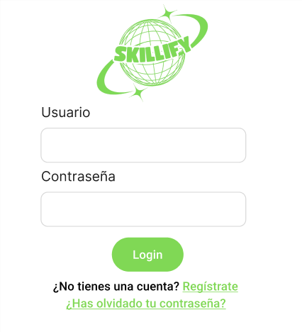

## Autenticación de Usuario en la Aplicación

Como **usuario registrado**, quiero poder **iniciar sesión** en la aplicación proporcionando mi **nombre de usuario** y **contraseña**, para acceder a mi cuenta y continuar con mi aprendizaje.

### Criterios de Aceptación:

Dado que me encuentro en la ventana de inicio de sesión,  
cuando ingreso mis credenciales correctamente y las envío,  
entonces accederé a la pantalla principal de la aplicación.

Si el nombre de usuario no existe o la contraseña es incorrecta,  
se mostrará un mensaje de error impidiendo el acceso.

### Checklist de ayuda al desarrollo

- [ ] El usuario debe poder ingresar su nombre de usuario y contraseña en el formulario de inicio de sesión.
- [ ] El sistema debe verificar que el nombre de usuario existe en la base de datos.
- [ ] Si la contraseña es incorrecta, se mostrará un mensaje de error.
- [ ] Si las credenciales son correctas, el usuario será redirigido a la pantalla principal de la aplicación.
- [ ] Si algún campo está vacío, se mostrará un mensaje indicando que todos los campos son obligatorios.
- [ ] Debe haber un enlace para recuperar la contraseña en caso de olvido.

### Ventana de Ejemplo:

