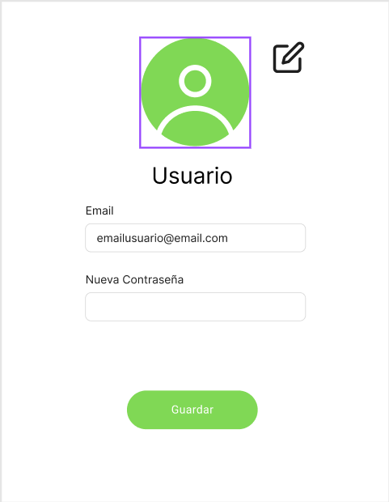

## Configuración de Usuario

Como **usuario autenticado**, quiero poder **modificar mis datos personales**, para personalizar mi experiencia en la aplicación.

### Criterios de Aceptación:

Dado que me encuentro en la ventana de configuración,  
cuando edito mis datos y los guardo,  
entonces la aplicación actualizará mi información correctamente.

### Checklist de ayuda al desarrollo

- [ ] El usuario puede cambiar su contraseña.
- [ ] El usuario puede cambiar su foto de perfil
- [ ] El sistema guarda los cambios y los mantiene en futuras sesiones.

### Ventana ejemplo configuracion

