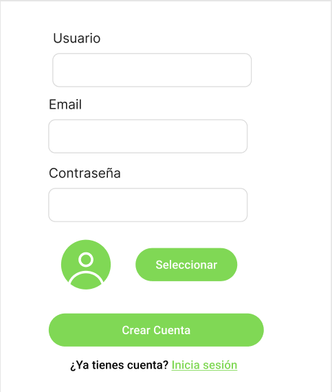

## Registro de un Nuevo Usuario en la Aplicación

Como **usuario nuevo**, quiero poder **registrarme en la aplicación** proporcionando mi **nombre de usuario**, **correo electrónico** y **contraseña**, para poder acceder a las funcionalidades de aprendizaje.

### Criterios de Aceptación:

Dado que me encuentro en la ventana de registro,  
cuando ingreso un nombre de usuario, correo electrónico y contraseña válidos,  
entonces el sistema validará los datos y me permitirá completar el registro.

Si algún campo está vacío o no cumple con los requisitos,  
se mostrará un mensaje de error impidiendo el registro.

### Checklist de ayuda al desarrollo

- [ ] El usuario debe poder ingresar un nombre de usuario, correo electrónico y contraseña en un formulario de registro.
- [ ] El sistema debe validar que el correo electrónico tenga un formato válido.
- [ ] La contraseña debe cumplir con los requisitos mínimos de seguridad (por ejemplo, al menos 8 caracteres).
- [ ] Si algún campo está vacío o es inválido, se mostrará un mensaje de error.
- [ ] Una vez registrado correctamente, el usuario será redirigido a la pantalla principal.
- [ ] Si el correo ya está en uso, el sistema debe mostrar un mensaje indicando que el usuario ya existe.

### Ventana de Ejemplo:

