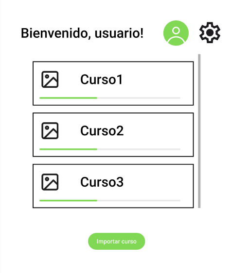

## Selección de Tema de Aprendizaje

Como **usuario autenticado**, quiero poder **seleccionar un tema de aprendizaje de una lista disponible**, para estudiar el contenido que me interesa.

### Criterios de Aceptación:

Dado que me encuentro en la ventana principal,  
cuando presiono en un tema de la lista,  
entonces podré acceder al contenido de la lección.

### Checklist de ayuda al desarrollo

- [ ] El usuario puede ver una lista de temas disponibles.
- [ ] Puede seleccionar un tema y comenzar la lección.
- [ ] Si no hay temas cargados, se muestra un mensaje indicando que debe añadir uno.
- [ ] La lista se obtiene desde un archivo JSON.

### Ejemplo ventana selección

